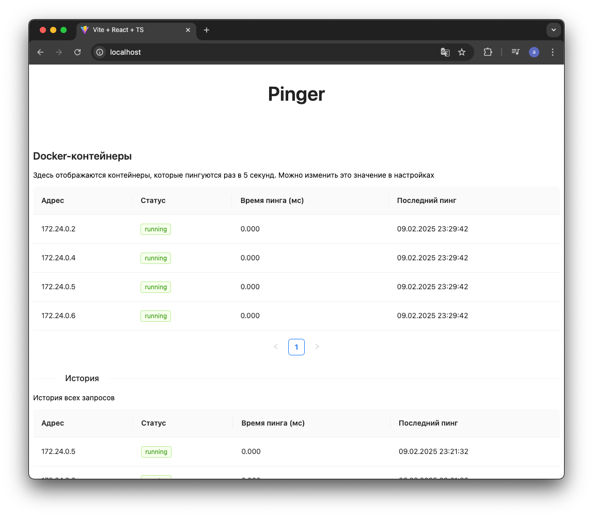

# Pinger
Pinger – это сервис, который получает адреса docker-контейнеров и пингует их.

## Как запустить?
Убедитесь, что у вас установлены Docker и Docker Compose и введите:
```bash
git clone https://github.com/soede/pinger.git
cd pinger
docker compose up
```
В таком случае сервер загрузит необходимые данные из переменных окружения (задаются в docker-compose.yml). \
Если необходимо задать свои параметры, то следует создать в корневой директории файл `config.yml`, где:
```yaml
app:
   env_name: "local" #local | staging | prod
   port: "8080"      #порт на котором будет запущен сервер
   readTimeout: 12   #(секунды) Если клиент не отправит полный запрос за указанное время, соединение будет закрыто
   writeTimeout: 12  #(секунды) Если сервер не успеет отправить ответ клиенту за указанное время, соединение закроется.

#Если изменить параметры подключения к БД, нужно будет изменить их для самой БД в docker-compose.yml
db:
   host: "db"
   port: "5432"
   user: "postgres"
   password: "somepassword"
   name: "postgres"
   ssl: "verify-full"                # disable | require | verify-ca | verify-full
   sslrootcert: "/path/to/root.crt"  # Корневой сертификат
   sslcert: "/path/to/client.crt"    # Клиентский сертификат
   sslkey: "/path/to/client.key"     # Приватный ключ
```
!!! Сначала сервер проверяет, есть ли `config.yml` в корневой директории проекта, 
если его нет – пытается загрузить данные из переменных окружения. \
Поэтому если необходимо запуститься с переменных окружения, то нужно удалить `config.yml`


## UI скриншоты


## Сервисы
1. **Сервер на Go (Golang 1.22+)**
   - Использует библиотеку net/http для обработки запросов. 
   - Написал сервер с новым http.NewServeMux(), поэтому нужна версия golang 1.23+.
   - Работает на порту 8080.
2. **Пингер**
    - Написан на Go
    - Использует библиотеку ping.
3. **PostgreSQL**
4. **Pinger-ui (Фронтенд)**
   - Написан на React (TypeScript) и собирается с помощью Vite. Взял UI из https://ant.design/
   - После сборки статические файлы копируются в контейнер NGINX
   - Работает по адресу http://localhost:80
5. **Migrate**
   - Запускает миграции при первом запуске
